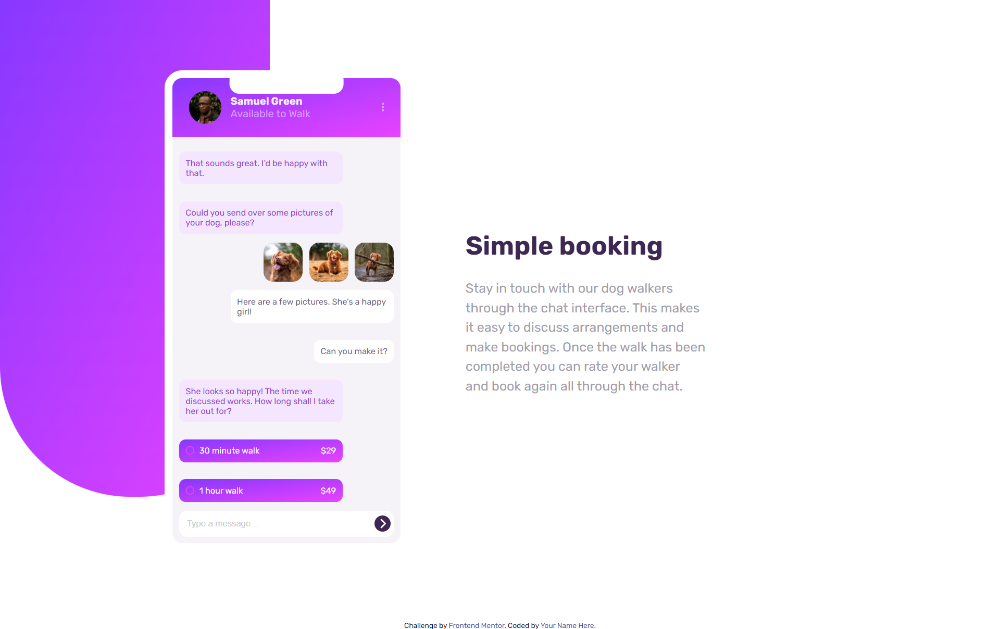

# Frontend Mentor - Chat app CSS illustration solution

This is a solution to the [Chat app CSS illustration challenge on Frontend Mentor](https://www.frontendmentor.io/challenges/chat-app-css-illustration-O5auMkFqY). Frontend Mentor challenges help you improve your coding skills by building realistic projects.

### The challenge

Users should be able to:

- View the optimal layout for the component depending on their device's screen size

### Screenshot

### Links

- Solution URL: [github link](https://github.com/Yussif20/chat-app-illustration)
- Live Site URL: [live site url](https://yussif20.github.io/chat-app-illustration/)

### Built with

- Semantic HTML5 markup
- CSS custom properties
- Flexbox
- SCSS

### What I learned

I was able to apply the css knowledge that I learned so far and even search for the ones I did't learn yet and using SCSS to have a well organized styles and Most important I was able for the first time to build a phone shape using only CSS which was a big challenge to me.

## Author

- Website - [Yusif Ayman](https://yussif20.github.io/main-portfolio/)
- linkedin - [Yusif Ayman](https://www.linkedin.com/in/yussif-ayman/)
- Github - [Yusif Ayman](https://github.com/Yussif20)
- Frontend Mentor - [Yusif ayman](https://www.frontendmentor.io/profile/Yussif20)
